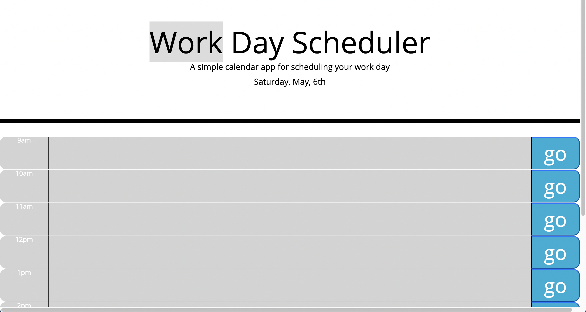

# Work Day Scheduler 
## Overview
Create a simple calendar application that allows a user to save events for each hour of the day by modifying starter code. This app will run in the browser and feature dynamically updated HTML and CSS powered by jQuery.

## Methods 
With the help of jQuery and moment.js, the HTML file and CSS file were dynamically updated to fulfill the needs of the user

## Link
Altogether we get a fully functional scheduler to help plan and organize one's day

[Work Day Scheduler](https://w9os.github.io/Work-day-scheduler/)